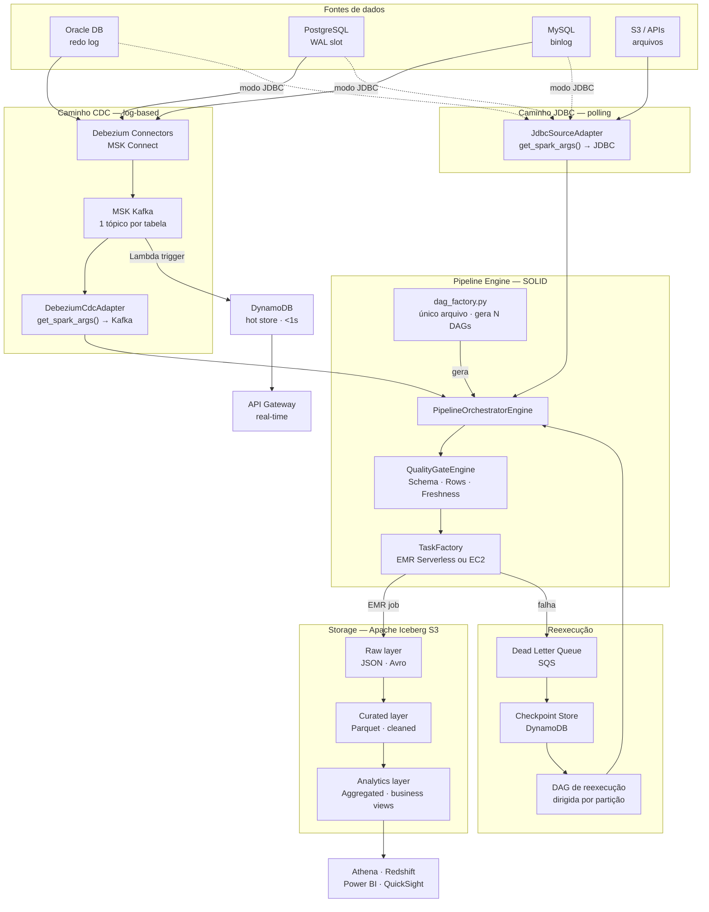
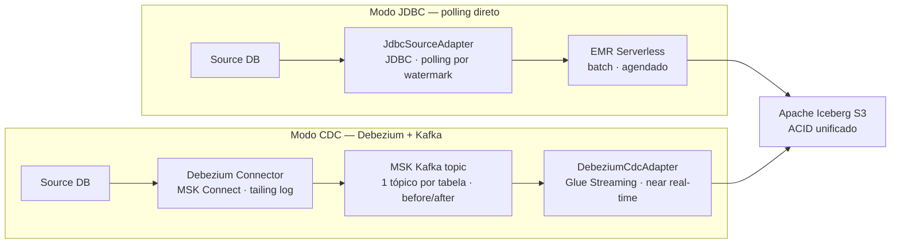
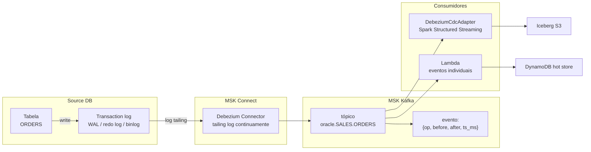
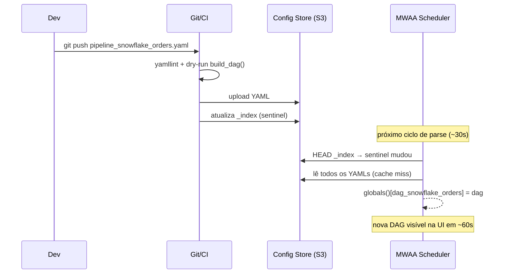
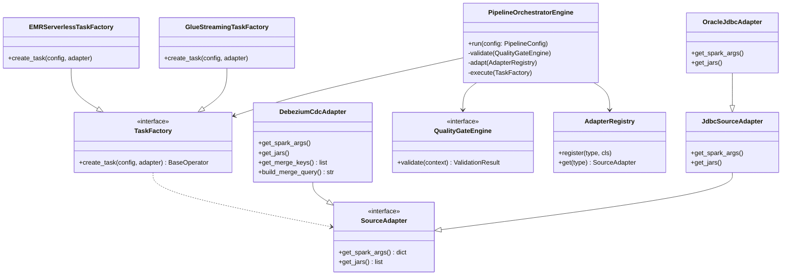
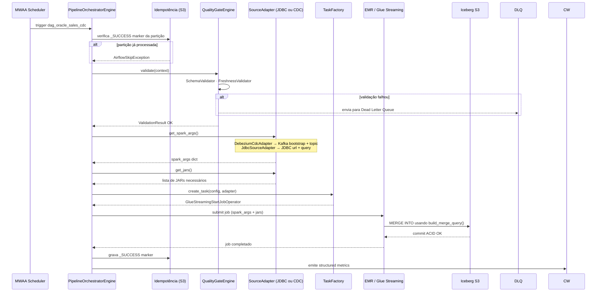
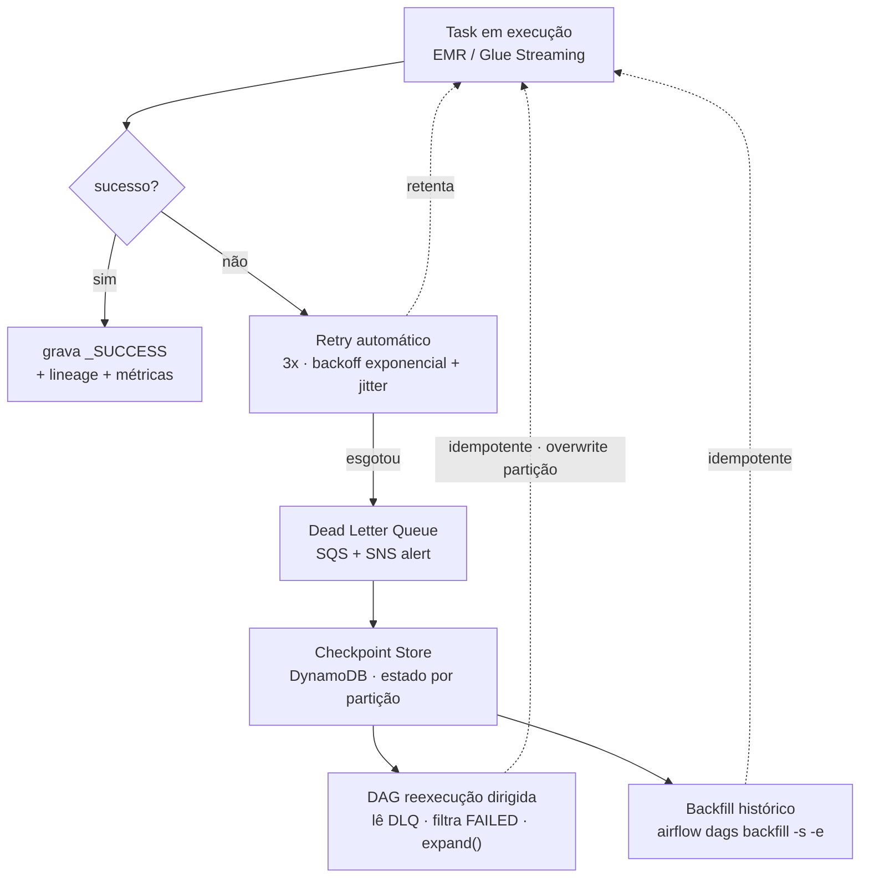
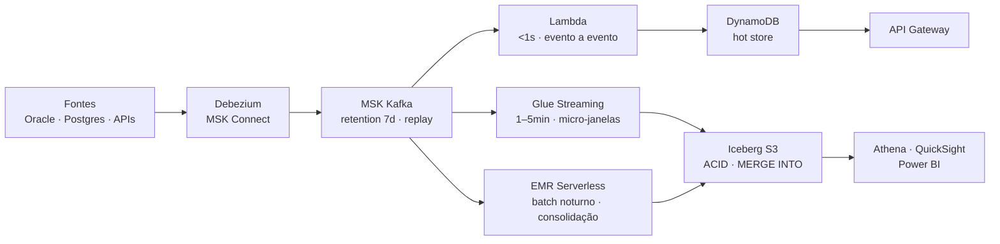
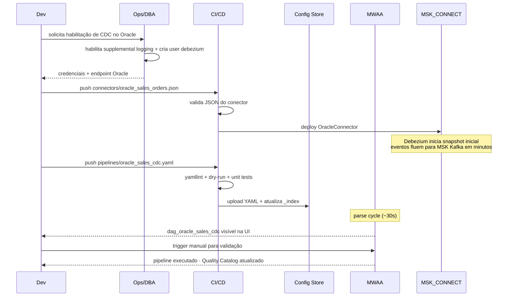

# Implementação Técnica — DAG Factory, CDC Debezium & Kafka

> **Versão:** 3.0 · Redesenho completo com CDC  
> **Escopo:** Orquestração dinâmica, CDC log-based, JDBC polling, real-time, reexecução  
> **Stack:** AWS MWAA · EMR Serverless · MSK Kafka · Debezium · MSK Connect · Iceberg · Glue

> 📘 **Documento complementar:** Para conceitos, princípios, anti-patterns, compliance e trade-offs, consulte o [README.md](./README.md).

---

## Sumário

1. [Visão Geral da Arquitetura](#1-visão-geral-da-arquitetura)
2. [Dois Modos de Ingestão — JDBC vs CDC](#2-dois-modos-de-ingestão--jdbc-vs-cdc)
   - [Quando usar cada modo](#21-quando-usar-cada-modo)
   - [Como o YAML seleciona o modo](#22-como-o-yaml-seleciona-o-modo)
3. [Debezium + MSK Kafka — CDC log-based](#3-debezium--msk-kafka--cdc-log-based)
   - [Pré-requisitos por banco](#31-pré-requisitos-por-banco)
   - [Configuração do conector](#32-configuração-do-conector)
   - [Formato do evento CDC](#33-formato-do-evento-cdc)
   - [DebeziumCdcAdapter](#34-debeziumcdcadapter)
4. [DAG Factory — geração dinâmica](#4-dag-factory--geração-dinâmica)
   - [O que o MWAA faz a cada 30s](#41-o-que-o-mwaa-faz-a-cada-30s)
   - [Cache com sentinela — só re-carrega quando muda](#42-cache-com-sentinela--só-re-carrega-quando-muda)
   - [Config inheritance](#43-config-inheritance)
5. [Componentes SOLID — Engine e Adapters](#5-componentes-solid--engine-e-adapters)
6. [Fluxo de Execução Completo](#6-fluxo-de-execução-completo)
7. [Reexecução — Retry, DLQ e Backfill](#7-reexecução--retry-dlq-e-backfill)
8. [Processamento em Real-Time](#8-processamento-em-real-time)
9. [Data Contracts e Qualidade](#9-data-contracts-e-qualidade)
10. [Observabilidade](#10-observabilidade)
11. [Decisões Arquiteturais](#11-decisões-arquiteturais)
12. [Experiência do Desenvolvedor](#12-experiência-do-desenvolvedor)
13. [Próximos Passos](#13-próximos-passos)
14. [Referências e Serviços](#referências-e-serviços)

---

## 1. Visão Geral da Arquitetura



---

## 2. Dois Modos de Ingestão — JDBC vs CDC



### 2.1 Quando usar cada modo

| Critério | JDBC — polling | CDC — Debezium |
|---|---|---|
| **Latência** | minutos a horas (depende do schedule) | segundos a minutos |
| **Impacto no banco** | query full/incremental a cada run | lê apenas o log — zero impacto em produção |
| **Captura de DELETEs** | não captura naturalmente | captura nativamente (op: "d") |
| **Captura de UPDATEs parciais** | requer coluna `updated_at` | captura qualquer mudança no registro |
| **Complexidade de setup** | mínima — só credenciais JDBC | requer habilitar log no DB + MSK Connect |
| **Volume de dados** | adequado para batches pequenos/médios | adequado para tabelas de alta frequência |
| **Histórico inicial (snapshot)** | natural — lê tudo na primeira run | requer snapshot inicial configurado |
| **Custo** | EMR por run | MSK Connect running cost contínuo |
| **Recomendação** | tabelas de referência · cargas agendadas | tabelas transacionais · rastreamento de deletes |

### 2.2 Como o YAML seleciona o modo

O `AdapterRegistry` lê o campo `source.type` e instancia o adapter correto. O `PipelineOrchestratorEngine` não sabe qual modo está usando.

```yaml
# Modo JDBC — polling
dag_id: oracle_sales_ingest
source:
  type: oracle_jdbc                   # → instancia OracleJdbcAdapter
  host: oracle-prod.internal
  port: 1521
  service: SALES
  table: ORDERS
  incremental_column: UPDATED_AT      # watermark para incremental
  incremental_lookback_hours: 2       # overlap para não perder dados no limite

# Modo CDC — Debezium
dag_id: oracle_sales_cdc
source:
  type: oracle_cdc                    # → instancia OracleDebeziumAdapter
  connector_name: oracle-sales-conn   # nome do conector MSK Connect
  schema: SALES
  table: ORDERS
  msk_bootstrap: ${MSK_BOOTSTRAP}
  starting_offset: latest             # latest | earliest | timestamp:2024-03-01

# Ambos herdam a mesma infra e quality gates
extends: base/emr_serverless
quality:
  - schema_validator
  - row_count_validator
```

---

## 3. Debezium + MSK Kafka — CDC log-based

### Como funciona



### 3.1 Pré-requisitos por banco

#### Oracle
```sql
-- Habilitar supplemental logging (obrigatório)
ALTER DATABASE ADD SUPPLEMENTAL LOG DATA;
ALTER TABLE SALES.ORDERS ADD SUPPLEMENTAL LOG DATA (ALL) COLUMNS;

-- Usuário Debezium com permissões mínimas
CREATE USER debezium IDENTIFIED BY "senha";
GRANT CREATE SESSION TO debezium;
GRANT SET CONTAINER TO debezium;
GRANT SELECT ON V_$DATABASE TO debezium;
GRANT FLASHBACK ANY TABLE TO debezium;
GRANT SELECT ANY TABLE TO debezium;
GRANT SELECT_CATALOG_ROLE TO debezium;
GRANT EXECUTE_CATALOG_ROLE TO debezium;
GRANT SELECT ANY TRANSACTION TO debezium;
GRANT LOGMINING TO debezium;                -- Oracle 12c+
```

#### PostgreSQL
```sql
-- Configurar wal_level para logical (requer restart do DB)
-- postgresql.conf:
--   wal_level = logical
--   max_replication_slots = 4
--   max_wal_senders = 4

-- Criar replication slot dedicado por conector
SELECT pg_create_logical_replication_slot('debezium_orders', 'pgoutput');

-- Publicação para as tabelas que serão monitoradas
CREATE PUBLICATION debezium_pub FOR TABLE public.orders, public.items;

-- Usuário com permissão de replicação
CREATE USER debezium WITH REPLICATION LOGIN PASSWORD 'senha';
GRANT SELECT ON ALL TABLES IN SCHEMA public TO debezium;
```

#### MySQL
```ini
# my.cnf — requer restart
[mysqld]
server-id         = 1
log_bin           = mysql-bin
binlog_format     = ROW              # obrigatório — não STATEMENT
binlog_row_image  = FULL             # captura registro completo before/after
expire_logs_days  = 7
```

```sql
-- Usuário Debezium
CREATE USER 'debezium'@'%' IDENTIFIED BY 'senha';
GRANT SELECT, RELOAD, SHOW DATABASES, REPLICATION SLAVE, REPLICATION CLIENT ON *.* TO 'debezium'@'%';
FLUSH PRIVILEGES;
```

---

### 3.2 Configuração do conector

O conector é definido como um arquivo JSON e deployado no MSK Connect via CLI ou Terraform:

```json
// connectors/oracle_sales_orders.json
{
  "name": "oracle-sales-orders-connector",
  "config": {
    "connector.class": "io.debezium.connector.oracle.OracleConnector",
    "tasks.max": "1",

    "database.hostname":         "${ORACLE_HOST}",
    "database.port":             "1521",
    "database.user":             "debezium",
    "database.password":         "${ORACLE_DEBEZIUM_PASSWORD}",
    "database.dbname":           "SALES",
    "database.server.name":      "oracle-sales",          // prefixo dos tópicos

    "table.include.list":        "SALES.ORDERS,SALES.ITEMS",
    "database.history.kafka.bootstrap.servers": "${MSK_BOOTSTRAP}",
    "database.history.kafka.topic": "schema-history.oracle-sales",

    "include.schema.changes":    "true",
    "snapshot.mode":             "initial",               // initial | schema_only | never

    // Transformações antes de publicar no tópico
    "transforms":                "unwrap,route",
    "transforms.unwrap.type":    "io.debezium.transforms.ExtractNewRecordState",
    "transforms.unwrap.drop.tombstones": "false",
    "transforms.unwrap.delete.handling.mode": "rewrite",

    // Serialização — Avro com Schema Registry
    "key.converter":             "io.confluent.kafka.serializers.KafkaAvroSerializer",
    "value.converter":           "io.confluent.kafka.serializers.KafkaAvroSerializer",
    "key.converter.schema.registry.url":   "${SCHEMA_REGISTRY_URL}",
    "value.converter.schema.registry.url": "${SCHEMA_REGISTRY_URL}"
  }
}
```

```python
# deploy via Python/boto3 — chamado pelo CI/CD
def deploy_connector(connector_config: dict):
    msk_connect = boto3.client("kafkaconnect")

    response = msk_connect.create_connector(
        connectorName=connector_config["name"],
        connectorConfiguration=connector_config["config"],
        kafkaCluster={
            "apacheKafkaCluster": {
                "bootstrapServers": MSK_BOOTSTRAP,
                "vpc": {"subnets": SUBNETS, "securityGroups": SECURITY_GROUPS},
            }
        },
        capacity={"autoScaling": {"minWorkerCount": 1, "maxWorkerCount": 4, "mcuCount": 1}},
        plugins=[{"customPlugin": {"customPluginArn": DEBEZIUM_PLUGIN_ARN, "revision": 1}}],
        serviceExecutionRoleArn=MSK_CONNECT_ROLE_ARN,
    )
    return response
```

---

### 3.3 Formato do evento CDC

Todo evento publicado pelo Debezium no Kafka tem um envelope padrão:

```json
// Evento de UPDATE na tabela SALES.ORDERS
// tópico: oracle-sales.SALES.ORDERS
{
  "before": {
    "ORDER_ID": 1001,
    "STATUS":   "PENDING",
    "AMOUNT":   150.00,
    "UPDATED_AT": 1710000000000
  },
  "after": {
    "ORDER_ID": 1001,
    "STATUS":   "SHIPPED",
    "AMOUNT":   150.00,
    "UPDATED_AT": 1710003600000
  },
  "source": {
    "connector": "oracle",
    "db":        "SALES",
    "schema":    "SALES",
    "table":     "ORDERS",
    "ts_ms":     1710003600000,
    "scn":       "123456789"             // Oracle: System Change Number
  },
  "op":     "u",                         // c=create  u=update  d=delete  r=read(snapshot)
  "ts_ms":  1710003600000
}
```

O `DebeziumCdcAdapter` usa o campo `op` para diferenciar inserts, updates e deletes, e `before`/`after` para aplicar MERGE INTO no Iceberg:

```python
# Mapeamento op → ação Iceberg
OP_ACTIONS = {
    "c": "INSERT",          # create
    "u": "MERGE",           # update — usa before.pk como chave
    "d": "DELETE",          # delete — usa before.pk como chave
    "r": "INSERT",          # snapshot read — primeiro carregamento
}
```

---

### 3.4 DebeziumCdcAdapter

```python
from pipeline_engine import register_adapter, SourceAdapter

@register_adapter("oracle_cdc")
@register_adapter("postgres_cdc")
@register_adapter("mysql_cdc")
class DebeziumCdcAdapter(SourceAdapter):
    """
    Adapter para fontes CDC via Debezium + Kafka.
    Implementa a mesma interface do JdbcSourceAdapter —
    o PipelineOrchestratorEngine não sabe a diferença.
    """

    def get_spark_args(self) -> dict:
        return {
            # Kafka source para Spark Structured Streaming
            "kafka.bootstrap.servers":  self.config.msk_bootstrap,
            "subscribe":                self._resolve_topic(),
            "startingOffsets":          self.config.starting_offset,  # latest | earliest
            "failOnDataLoss":           "false",
            "maxOffsetsPerTrigger":     str(self.config.max_offsets_per_trigger or 100_000),

            # Schema Registry para desserializar Avro
            "kafka.schema.registry.url": self.config.schema_registry_url,
        }

    def get_jars(self) -> list[str]:
        return [
            "spark-sql-kafka-0-10_2.12-3.4.0.jar",
            "kafka-clients-3.4.0.jar",
            "spark-avro_2.12-3.4.0.jar",
            "kafka-schema-registry-client-7.4.0.jar",
        ]

    def get_merge_keys(self) -> list[str]:
        """Colunas que identificam unicamente um registro — usadas no MERGE INTO Iceberg."""
        return self.config.primary_keys  # ex: ["ORDER_ID"]

    def _resolve_topic(self) -> str:
        """
        Converte config YAML para nome do tópico Debezium.
        Padrão: {server_name}.{schema}.{table}
        """
        return (
            f"{self.config.connector_name}"
            f".{self.config.schema}"
            f".{self.config.table}"
        )

    def build_merge_query(self, staging_table: str, target_table: str) -> str:
        """
        Gera o MERGE INTO Iceberg considerando os três ops CDC.
        Chamado pelo EMRJob após ler os eventos do Kafka.
        """
        keys_condition = " AND ".join(
            f"target.{k} = source.{k}" for k in self.get_merge_keys()
        )
        return f"""
            MERGE INTO {target_table} AS target
            USING (
                SELECT * FROM {staging_table}
                WHERE op IN ('c', 'u', 'd', 'r')
            ) AS source
            ON {keys_condition}
            WHEN MATCHED AND source.op = 'd'
                THEN DELETE
            WHEN MATCHED AND source.op IN ('u', 'r')
                THEN UPDATE SET *
            WHEN NOT MATCHED AND source.op IN ('c', 'r')
                THEN INSERT *
        """
```

---

## 4. DAG Factory — geração dinâmica

### Conceito

Um único `dag_factory.py` lê todos os YAMLs do Config Store e registra cada pipeline como uma DAG via `globals()`. Desenvolvedores só precisam escrever YAML.

```python
# dags/dag_factory.py

import boto3
from pipeline_engine import ConfigLoader, DagBuilder

s3 = boto3.client("s3")

def get_sentinel() -> str:
    """HEAD request barato — detecta se qualquer YAML mudou."""
    resp = s3.head_object(Bucket=CONFIG_BUCKET, Key="pipelines/_index")
    return str(resp["LastModified"])

from functools import lru_cache

@lru_cache(maxsize=1)
def load_configs_cached(sentinel: str):
    """Cache invalidado automaticamente quando o sentinel muda."""
    return ConfigLoader.from_s3(bucket=CONFIG_BUCKET, prefix="pipelines/")

# Executado a cada ~30s pelo MWAA scheduler
sentinel = get_sentinel()              # 1 HEAD request leve
configs  = load_configs_cached(sentinel)  # cache miss somente quando YAML mudou

for cfg in configs:
    dag = DagBuilder(cfg).build()
    globals()[dag.dag_id] = dag        # Airflow descobre via globals()
```

### 4.1 O que o MWAA faz a cada 30s

O Airflow re-executa `dag_factory.py` a cada `min_file_process_interval` (~30s). O impacto real por ciclo:

| Etapa | Custo sem cache | Custo com cache |
|---|---|---|
| Python re-executa | milissegundos | milissegundos |
| `get_sentinel()` HEAD request | ~10ms | ~10ms (sempre roda — é barato) |
| `load_configs_cached()` lê S3 | ~200ms por YAML | **zero** — `lru_cache` retorna imediatamente |
| Airflow diff contra DB | milissegundos | milissegundos |
| **Total por ciclo** | **200ms × N YAMLs** | **~15ms** |

> Com o sentinel, o S3 só é lido quando um YAML é realmente alterado. O scheduler não sofre.

**Regra de ouro:** nunca colocar I/O sem cache no top-level do `dag_factory.py`. O parse deve completar em < 1s, independente do número de pipelines.

### 4.2 Cache com sentinela — só re-carrega quando muda

O CI/CD atualiza o arquivo `_index` a cada push de YAML:

```bash
# .github/workflows/deploy_pipeline.yml
- name: Upload YAML to Config Store
  run: |
    aws s3 cp pipeline_snowflake_orders.yaml s3://$CONFIG_BUCKET/pipelines/
    # Atualiza o sentinela — invalida o cache do dag_factory
    echo "$(date -u +%Y-%m-%dT%H:%M:%SZ)" | aws s3 cp - s3://$CONFIG_BUCKET/pipelines/_index
```

Fluxo completo do push ao DAG visível na UI:



### 4.3 Config inheritance

```yaml
# s3://config-store/pipelines/base/emr_serverless.yaml
_base: true
infra:
  type: emr_serverless
  app_id: ${EMR_APP_ID}
  execution_role: ${EMR_ROLE_ARN}
orchestration:
  retries: 3
  retry_delay_minutes: 5
  retry_exponential_backoff: true
  timeout_minutes: 120
quality:
  - schema_validator
  - metadata_validator
monitoring:
  cloudwatch_namespace: data-pipelines
  alert_sns_topic: ${SNS_ALERT_TOPIC}
idempotency:
  enabled: true
  marker: _SUCCESS

# s3://config-store/pipelines/base/cdc_streaming.yaml
_base: true
extends: base/emr_serverless
infra:
  type: glue_streaming
  worker_type: G.1X
  number_of_workers: 2
  window_minutes: 5
  watermark_minutes: 2

# s3://config-store/pipelines/oracle_sales_cdc.yaml — 12 linhas
extends: base/cdc_streaming
dag_id: oracle_sales_cdc
source:
  type: oracle_cdc
  connector_name: oracle-sales-conn
  schema: SALES
  table: ORDERS
  primary_keys: [ORDER_ID]
quality:
  - schema_validator
  - freshness_validator    # alerta se stream parar por > 10min
```

---

## 5. Componentes SOLID — Engine e Adapters



### Seleção automática de TaskFactory por modo

```python
# DagBuilder resolve a factory correta pelo config YAML
class DagBuilder:
    def _resolve_factory(self, cfg: PipelineConfig) -> TaskFactory:
        if cfg.infra.type == "emr_serverless":
            return EMRServerlessTaskFactory(cfg.infra)
        if cfg.infra.type == "glue_streaming":
            return GlueStreamingTaskFactory(cfg.infra)
        if cfg.infra.type == "emr_ec2":
            return EMREc2TaskFactory(cfg.infra)
        raise UnsupportedInfraError(cfg.infra.type)

    def _resolve_adapter(self, cfg: PipelineConfig) -> SourceAdapter:
        """AdapterRegistry descobre o adapter pelo decorador @register_adapter."""
        return AdapterRegistry.get(cfg.source.type)
```

---

## 6. Fluxo de Execução Completo



---

## 7. Reexecução — Retry, DLQ e Backfill



### CDC e reexecução — replay do Kafka

Para CDC, a reexecução tem uma vantagem extra: o Kafka tem retenção configurável (padrão 7 dias). Após correção de bug em um adapter ou validador, é possível reprocessar sem restaurar backup:

```python
# Rebobina o consumer group para o timestamp da falha
def replay_from_timestamp(topic: str, timestamp_ms: int):
    consumer = KafkaConsumer(bootstrap_servers=MSK_BOOTSTRAP)
    partitions = consumer.partitions_for_topic(topic)

    # Obtém offsets para o timestamp específico
    tp_list = [TopicPartition(topic, p) for p in partitions]
    offsets = consumer.offsets_for_times(
        {tp: timestamp_ms for tp in tp_list}
    )

    # Reseta o consumer group para esses offsets
    for tp, offset_and_ts in offsets.items():
        consumer.seek(tp, offset_and_ts.offset)

    # O DebeziumCdcAdapter relê a partir desse ponto
    # MERGE INTO Iceberg garante idempotência — sem duplicatas
```

### Idempotência — JDBC e CDC unificada

Toda escrita é endereçada por partição-chave + `run_date`. Re-run = overwrite atômico:

```
# JDBC batch
s3://curated/sales/orders/year=2024/month=03/day=15/
  _SUCCESS
  part-00000.parquet

# CDC streaming (micro-janelas)
s3://curated/sales/orders/year=2024/month=03/day=15/hour=10/minute=30/
  _SUCCESS
  part-00000.parquet
```

---

## 8. Processamento em Real-Time



| Caminho | Latência | Caso de uso |
|---|---|---|
| Lambda (event trigger) | < 1s | Alertas imediatos · hot store · webhooks |
| Glue Streaming (micro-janela) | 1–5 min | Dashboards operacionais · near real-time |
| EMR batch (consolidação) | horas | Histórico completo · reconciliação · SCD Type 2 |

---

## 9. Data Contracts e Qualidade

### Schema Registry integrado ao CDC

O Glue Schema Registry valida automaticamente os eventos Debezium antes de processar:

```python
@register_adapter("oracle_cdc")
class OracleDebeziumAdapter(DebeziumCdcAdapter):

    def validate_schema(self, event: dict) -> ValidationResult:
        """Valida o evento Debezium contra o contrato registrado."""
        schema_arn = self._get_schema_arn()
        schema_def = glue.get_schema_version(SchemaVersionId=schema_arn)

        avro_schema = avro.parse(schema_def["SchemaDefinition"])
        try:
            avro.validate(event["after"], avro_schema)
            return ValidationResult(status="PASS")
        except avro.SchemaParseException as e:
            return ValidationResult(
                status="FAIL",
                error=str(e),
                recommendation="Verifique se o schema do conector está atualizado."
            )
```

### Quality Catalog — histórico consultável

```sql
-- Qualidade por pipeline nos últimos 30 dias
SELECT
    pipeline,
    source_type,
    validator,
    COUNT(*)                        AS total_runs,
    SUM(CASE WHEN status='FAIL' THEN 1 ELSE 0 END) AS failures,
    AVG(duration_ms)               AS avg_duration_ms,
    MAX(run_date)                  AS last_run
FROM quality_catalog
WHERE run_date >= CURRENT_DATE - INTERVAL '30' DAY
GROUP BY pipeline, source_type, validator
ORDER BY failures DESC, pipeline;

-- Detectar drift de schema no CDC
SELECT
    pipeline,
    run_date,
    JSON_EXTRACT(violations, '$[0].field') AS field_with_issue,
    JSON_EXTRACT(violations, '$[0].expected_type') AS expected,
    JSON_EXTRACT(violations, '$[0].actual_type') AS actual
FROM quality_catalog
WHERE validator = 'schema_validator'
  AND source_type LIKE '%_cdc'
  AND status = 'FAIL'
ORDER BY run_date DESC
LIMIT 50;
```

> 📘 **Complemento conceitual:** Para exemplos detalhados de Data Contracts com versionamento SemVer, evolução de schema e governança Data Mesh, consulte o [README.md — Governança Operacional](./README.md#4️⃣-governança-operacional-data-mesh-real).

---

## 10. Observabilidade

### Alertas automáticos gerados pelo YAML

```yaml
# Parte de qualquer pipeline YAML — DagBuilder cria os alarmes automaticamente
monitoring:
  alerts:
    # CDC: alerta se o stream parar
    - metric: streaming.freshness_seconds
      threshold: 600                # alerta se não chegar evento por > 10min
      sns_topic: ${SNS_CRITICAL}
      message: "Stream CDC parado: {pipeline}"

    # CDC: alerta se consumer lag crescer demais
    - metric: kafka.consumer_lag
      threshold: 100000             # 100k mensagens de atraso
      sns_topic: ${SNS_WARNING}

    # JDBC: alerta se job demorar mais que o esperado
    - metric: task.duration_ms
      threshold: 3600000            # 1 hora
      sns_topic: ${SNS_WARNING}

    # Qualquer modo: qualidade
    - metric: quality_gate.result
      status: FAIL
      threshold: 1
      sns_topic: ${SNS_CRITICAL}

    # Debezium: alerta se conector parar
    - metric: debezium.connector_status
      status: FAILED
      sns_topic: ${SNS_CRITICAL}
      auto_restart: true            # DagBuilder cria Lambda para restart automático
```

### Stack completo de observabilidade

| Ferramenta | O que monitora |
|---|---|
| CloudWatch Metrics | duration, row count, quality score por pipeline e modo |
| CloudWatch Logs (structured JSON) | todos os eventos de componentes em formato consultável |
| MSK Monitoring (CloudWatch) | consumer lag, throughput, offset by topic |
| Debezium JMX metrics → CloudWatch | connector status, snapshot progress, lag de WAL |
| Quality Catalog (Iceberg + Athena) | histórico de validações · SLA tracking · drift detection |
| OpenLineage | linhagem automática — quem leu o quê, quando, com qual schema |
| AWS CloudTrail | auditoria de acesso e mudanças de infraestrutura |

> 📘 **Complemento conceitual:** Para as 4 dimensões de observabilidade (Latência, Volume, Qualidade, Custo), SLOs com alertas e exemplos PromQL, consulte o [README.md — Observabilidade](./README.md#5️⃣-observabilidade-end-to-end).

---

## 11. Decisões Arquiteturais

### JDBC vs CDC — por pipeline, não por arquitetura

A decisão não é "usar JDBC ou Debezium na arquitetura". A decisão é por tabela, configurada no YAML:

```yaml
# Tabela de referência pequena — JDBC é suficiente
dag_id: dim_products_ingest
source:
  type: oracle_jdbc
  table: DIM_PRODUCTS         # 50k registros · muda raramente

# Tabela transacional de alto volume — CDC é necessário
dag_id: fact_orders_cdc
source:
  type: oracle_cdc
  table: FACT_ORDERS          # 2M+ inserts/dia · deletes precisam ser capturados
```

### MSK Kafka vs Kinesis

Para a camada CDC, MSK Kafka é a escolha correta (Debezium tem suporte nativo). Kinesis pode ser usado para outros fluxos (APIs, crawlers), mas não substitui Kafka para CDC:

| Critério | MSK Kafka | Kinesis |
|---|---|---|
| Suporte Debezium | nativo | não — Debezium não suporta Kinesis como sink |
| Consumer groups | sim — múltiplos consumidores independentes | via DynamoDB (complexo) |
| Replay por offset | preciso — offset exato | aproximado — por timestamp |
| Retenção padrão | 7 dias (configurável para mais) | 24h (padrão) a 365 dias (Express) |
| Recomendação para CDC | **sim** | não |

### EMR Serverless vs Glue Streaming para CDC

| Critério | Glue Streaming | EMR Serverless |
|---|---|---|
| Janelas de micro-batch | nativo — Spark SS | configurável |
| Cold start para streaming | lento (2-3 min) | lento (1-3 min) |
| Custo contínuo (job sempre rodando) | por DPU/hora | por vCPU/hora usado |
| Controle do job Spark | limitado (Glue UI) | total |
| Recomendação | near real-time simples | CDC com lógica complexa de MERGE |

---

## 12. Experiência do Desenvolvedor

### Novo pipeline CDC — do zero ao produção



### Antes vs Depois — resumo

| Tarefa | Antes | Depois |
|---|---|---|
| Novo pipeline CDC | código Python + configuração de infraestrutura | 1 JSON de conector + 15 linhas de YAML |
| Novo pipeline JDBC | ~200 linhas Python + PR + deploy | 15 linhas YAML + push S3 |
| Nova fonte de dados | adapter manual + registro manual | `@register_adapter("nova_fonte")` |
| Capturar DELETEs | lógica customizada por pipeline | `op: "d"` no evento CDC — automático |
| Reprocessar após bug | processo manual e arriscado | replay do Kafka por timestamp |
| Trocar infra (Serverless → EC2) | editar N arquivos Python | 1 linha no `base.yaml` |
| Debug de falha de schema | logs de texto soltos | query no Quality Catalog com SQL |

---

## 13. Próximos Passos

| Item | Responsável | Sprint | Prioridade |
|---|---|---|---|
| Habilitar CDC nos bancos (supplemental log Oracle, WAL Postgres) | DBA/Ops | 0 — pré-requisito | Crítico |
| Deploy MSK cluster e MSK Connect | DevOps | 0 — pré-requisito | Crítico |
| Plugin Debezium no MSK Connect (Oracle + Postgres) | DevOps | 1 | Alta |
| Implementar `DebeziumCdcAdapter` com `@register_adapter` | Data Eng | 1 | Alta |
| `dag_factory.py` com cache sentinela + DagBuilder | Data Eng | 1 | Alta |
| Config inheritance + base YAMLs (emr_serverless, cdc_streaming) | Data Eng | 1 | Alta |
| CI/CD: deploy de conector JSON + upload YAML + atualiza `_index` | DevOps | 2 | Alta |
| Checkpoint Store DynamoDB + DAG de reexecução dirigida | Data Eng | 2 | Alta |
| QualityGateEngine com `FreshnessValidator` para CDC | Data Eng | 2 | Alta |
| Quality Catalog (Iceberg + queries Athena) | Data Eng | 3 | Média |
| Glue Schema Registry + validação de contratos CDC | Data Eng | 3 | Média |
| Alertas automáticos por YAML (consumer lag, connector status) | Data Eng | 3 | Média |
| Lambda trigger para hot store (DynamoDB) via MSK | Data Eng | 4 | Média |
| OpenLineage integrado ao Airflow e EMR | Data Eng | 4 | Baixa |
| Runbook: troubleshooting de conectores Debezium em produção | Tech Lead | 3 | Média |

---

## Referências e Serviços

| Serviço | Utilização |
|---|---|
| AWS MWAA | Orquestração · scheduler do Airflow · DAG Factory |
| Amazon MSK (Kafka) | Event bus para CDC · retenção 7 dias · replay nativo |
| AWS MSK Connect | Hosting dos Debezium Connectors gerenciado |
| Debezium | CDC connectors: Oracle · PostgreSQL · MySQL |
| AWS EMR Serverless | Processamento Spark batch e CDC consolidação |
| AWS Glue Streaming | Processamento near real-time com Spark Structured Streaming |
| Amazon S3 | Config Store · Data Lake Raw / Curated / Analytics |
| Apache Iceberg | Tabelas ACID — MERGE INTO para upsert/delete CDC |
| Glue Schema Registry | Contratos de dados versionados · Avro serialization |
| Amazon DynamoDB | Checkpoint Store · hot store · parâmetros ETL |
| Amazon SQS | Dead Letter Queue para falhas de pipeline |
| Amazon SNS | Notificações de alertas · escalation |
| Amazon CloudWatch | Métricas · logs estruturados · alarmes |
| AWS CloudTrail | Auditoria de acesso e governança |
| Amazon Athena | Queries ad-hoc · Quality Catalog · lineage |
| AWS Lake Formation | Controle de acesso granular ao Data Lake |
| Amazon QuickSight | Dashboards e visualizações |
| OpenLineage | Linhagem automática de dados |
